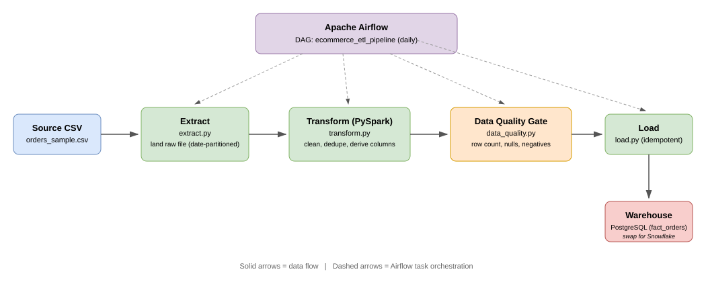

# End-to-End E-Commerce ETL Pipeline (Airflow + PySpark + PostgreSQL)

A production-style ETL pipeline that extracts raw e-commerce order data, cleans and enriches it with **PySpark**, runs automated data-quality checks, and loads it into an analytics warehouse — all orchestrated by **Apache Airflow** and fully containerized with Docker.

This project demonstrates the same design pattern used for large-scale production pipelines (Databricks/EMR + Airflow + Snowflake), scaled down to run reproducible on a laptop.

## 📌 Why this project
Real ETL pipelines fail quietly when data is dirty, late, or duplicated. This pipeline is built around three things that matter in production:
- **Idempotency** — re-running a day's load never creates duplicate rows.
- **Data quality gates** — bad data is caught and blocks the load, instead of silently reaching the warehouse.
- **Separation of concerns** — extract, transform, load, and quality-check logic each live in their own testable module, orchestrated (not implemented) by the DAG.

## 🏗️ Architecture


**Flow:**
1. **Extract** — raw CSV is copied into a date-partitioned landing zone (simulates pulling from a source DB/API).
2. **Transform** — PySpark reads the landing file, enforces a schema, handles nulls, de-duplicates on `order_id`, derives `revenue`/`order_year`/`order_month`, and filters out non-completed orders. Output is written as Parquet.
3. **Data Quality Gate** — row count, null, and negative-revenue checks run against the transformed Parquet. The task fails (blocking the load) if any check fails.
4. **Load** — cleaned Parquet is loaded into a PostgreSQL `fact_orders` table using a delete-then-insert pattern per batch of `order_id`s, making re-runs idempotent.

## 🛠️ Technologies Used

| Category | Tech |
|---|---|
| Orchestration | Apache Airflow 2.9 (LocalExecutor) |
| Processing | PySpark 3.5 |
| Warehouse | PostgreSQL 15 |
| Language | Python 3.10 |
| Containerization | Docker, Docker Compose |
| Data format | CSV (source) → Parquet (processed) |

## 📁 Repository Structure
```
ecommerce-etl-pipeline/
├── dags/
│   └── ecommerce_etl_dag.py     # Airflow DAG definition
├── scripts/
│   ├── extract.py               # Extract layer
│   ├── transform.py             # PySpark transform layer
│   ├── load.py                  # Load layer (Postgres)
│   └── data_quality.py          # Data quality gate
├── data/
│   └── raw/orders_sample.csv    # Sample source data
├── sql/
│   └── init_warehouse.sql       # Warehouse table DDL
├── diagrams/
│   ├── architecture.drawio      # Editable diagram source
│   └── architecture.svg         # Rendered diagram
├── screenshots/                 # DAG run screenshots / demo GIF
├── tests/
│   └── test_transform.py        # Unit tests for transform logic
├── Dockerfile
├── docker-compose.yml
├── requirements.txt
├── .env.example
└── .gitignore
```

## 🚀 How to Run Locally

**Prerequisites:** Docker & Docker Compose installed.

1. Clone the repo and enter it:
   ```bash
   git clone https://github.com/<your-username>/ecommerce-etl-pipeline.git
   cd ecommerce-etl-pipeline
   ```

2. Create your environment file from the example:
   ```bash
   cp .env.example .env
   # then edit .env and set real passwords
   ```

3. Build and start all services:
   ```bash
   docker compose up --build
   ```

4. Open the Airflow UI: [http://localhost:8080](http://localhost:8080)
   (login with the `AIRFLOW_ADMIN_USER` / `AIRFLOW_ADMIN_PASSWORD` you set in `.env`)

5. Trigger the `ecommerce_etl_pipeline` DAG manually (▶ button), or wait for its daily schedule.

6. Verify the load — connect to the warehouse and query:
   ```bash
   docker exec -it ecommerce-etl-pipeline-warehouse-db-1 \
     psql -U <WAREHOUSE_DB_USER> -d <WAREHOUSE_DB_NAME> -c "SELECT * FROM fact_orders LIMIT 10;"
   ```

7. Shut everything down:
   ```bash
   docker compose down -v
   ```

### Running the transform script standalone (no Airflow)
Useful for quick local debugging of the PySpark logic:
```bash
pip install -r requirements.txt
python scripts/extract.py
python scripts/transform.py data/landing/dt=2024-01-19/orders_raw.csv 2024-01-19
```

## 🔁 Swapping PostgreSQL for Snowflake
`load.py` is intentionally isolated so the warehouse target can change without touching `extract.py` or `transform.py`. To point at Snowflake instead:
1. Add `snowflake-connector-python` (or `snowflake-sqlalchemy`) to `requirements.txt`.
2. Replace `get_warehouse_engine()` in `scripts/load.py` with a Snowflake connection using the `SNOWFLAKE_*` variables already stubbed out in `.env.example`.
3. Replace the `DELETE ... WHERE order_id IN (...)` idempotency pattern with a `MERGE INTO` statement, which is Snowflake's native upsert.

## ✅ Data Quality Checks
Implemented in `scripts/data_quality.py`, run as its own Airflow task **before** load:
- Row count above a configurable minimum threshold
- No nulls in `order_id`, `order_date`, `revenue`
- No negative revenue values

## 🖼️ Screenshots
See [`screenshots/`](screenshots/)
## 👤 Author
**Mohammed Mubariz** — Big Data Engineer
[LinkedIn](https://linkedin.com/in/mubariz06) · gulammohammedmubarizuddin@gmail.com
